# MeowBTI

> Understand your cat's personality through 24 everyday behavior questions.

[Try MeowBTI online](https://shawnjoeng.github.io/MeowBTI/)

MeowBTI is a playful personality test for cats. It observes four dimensions of everyday behavior: social energy, exploration style, interaction response, and daily rhythm. After 24 questions, it creates a personalized Cat Persona Card and a deeper personality report.

The interface supports both Chinese and English. Use the language switch in the top-right corner to translate the test, results, gallery, and downloadable card.

## 16 Cat Personas

<table width="100%">
<colgroup>
<col width="25%">
<col width="25%">
<col width="25%">
<col width="25%">
</colgroup>
<tr>
<td width="25%" align="center" valign="top">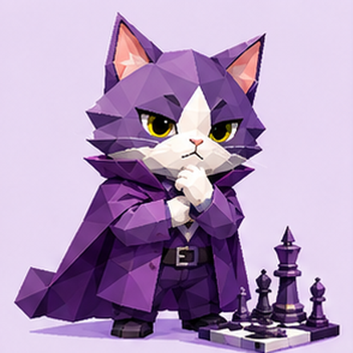</td>
<td width="25%" align="center" valign="top">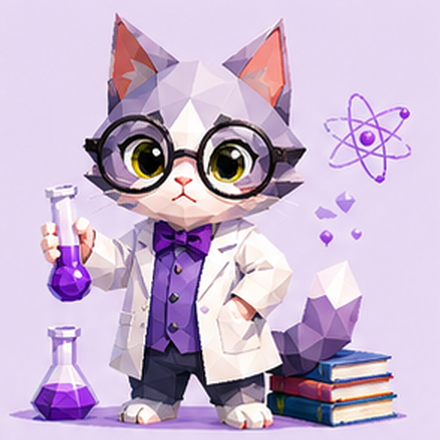</td>
<td width="25%" align="center" valign="top">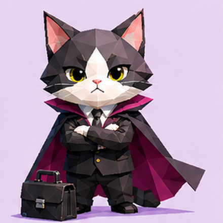</td>
<td width="25%" align="center" valign="top">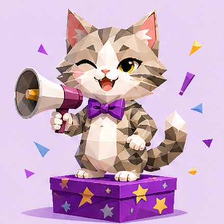</td>
</tr>
<tr>
<td width="25%" align="center" valign="top"><strong>INTJ · Mastermind Meow</strong> Strategic · Goal-driven · Efficient</td>
<td width="25%" align="center" valign="top"><strong>INTP · Lab Meow</strong> Experimental · Focused · Brainy</td>
<td width="25%" align="center" valign="top"><strong>ENTJ · Captain Meow</strong> Commanding · Goal-driven · In control</td>
<td width="25%" align="center" valign="top"><strong>ENTP · Breakthrough Meow</strong> Problem-solving · Clever · Boundary-testing</td>
</tr>
<tr>
<td width="25%" align="center" valign="top">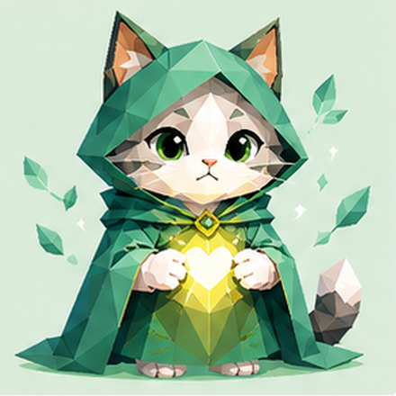</td>
<td width="25%" align="center" valign="top">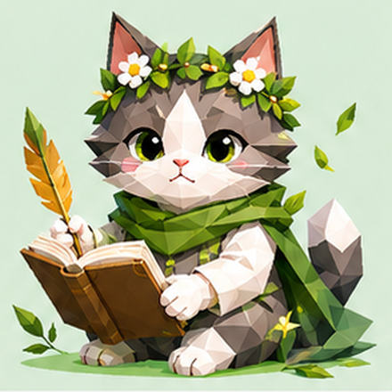</td>
<td width="25%" align="center" valign="top">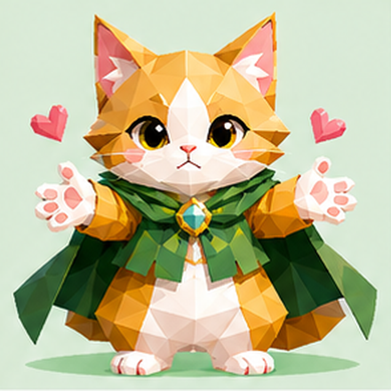</td>
<td width="25%" align="center" valign="top">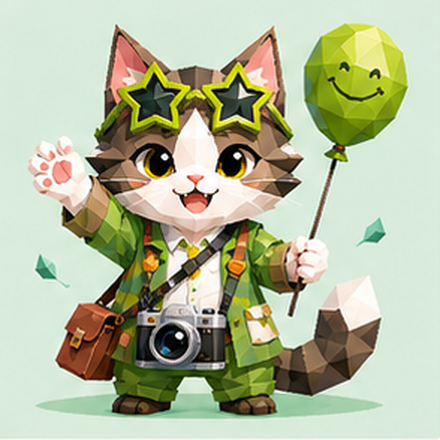</td>
</tr>
<tr>
<td width="25%" align="center" valign="top"><strong>INFJ · Insight Meow</strong> Perceptive · Reserved · Deeply connected</td>
<td width="25%" align="center" valign="top"><strong>INFP · Poet Meow</strong> Slow to warm up · Empathetic · Spontaneous</td>
<td width="25%" align="center" valign="top"><strong>ENFJ · Harmony Meow</strong> Attentive · Empathetic · Organizing</td>
<td width="25%" align="center" valign="top"><strong>ENFP · Adventure Meow</strong> Curious · Energetic · Imaginative</td>
</tr>
<tr>
<td width="25%" align="center" valign="top"></td>
<td width="25%" align="center" valign="top">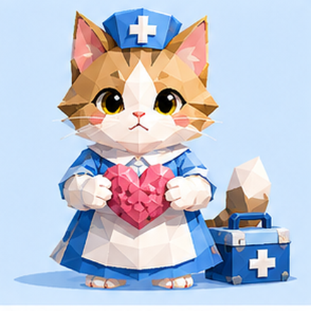</td>
<td width="25%" align="center" valign="top">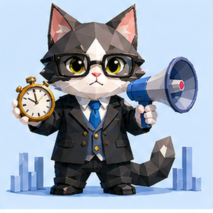</td>
<td width="25%" align="center" valign="top">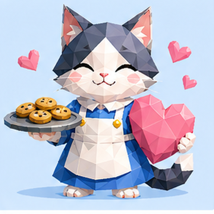</td>
</tr>
<tr>
<td width="25%" align="center" valign="top"><strong>ISTJ · Orderly Meow</strong> Structured · Punctual · Predictable</td>
<td width="25%" align="center" valign="top"><strong>ISFJ · Care Meow</strong> Supportive · Reliable · Routine-loving</td>
<td width="25%" align="center" valign="top"><strong>ESTJ · Manager Meow</strong> Organized · Clear · Gets things done</td>
<td width="25%" align="center" valign="top"><strong>ESFJ · Sweetheart Meow</strong> Warm · Responsive · Ritual-loving</td>
</tr>
<tr>
<td width="25%" align="center" valign="top">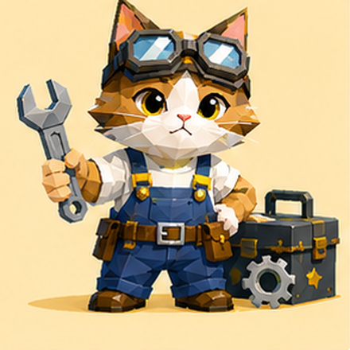</td>
<td width="25%" align="center" valign="top">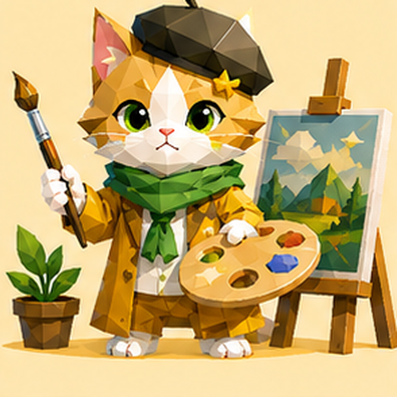</td>
<td width="25%" align="center" valign="top">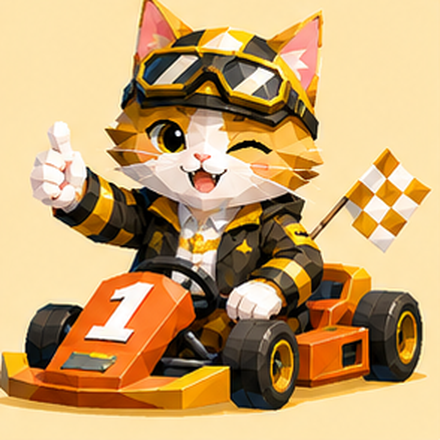</td>
<td width="25%" align="center" valign="top">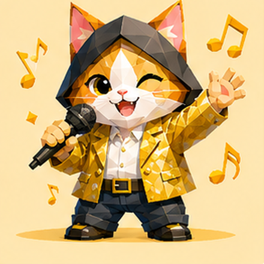</td>
</tr>
<tr>
<td width="25%" align="center" valign="top"><strong>ISTP · Maker Meow</strong> Hands-on · Independent · Adaptable</td>
<td width="25%" align="center" valign="top"><strong>ISFP · Chill Meow</strong> Sensory · Easygoing · Aesthetic</td>
<td width="25%" align="center" valign="top"><strong>ESTP · Action Meow</strong> Active · Daring · In the moment</td>
<td width="25%" align="center" valign="top"><strong>ESFP · Vibe Meow</strong> Expressive · Playful · Instant feedback</td>
</tr>
</table>

## Four Persona Groups

| Color group | Types | Persona keywords |
|---|---|---|
| Purple · Analysts | INTJ / INTP / ENTJ / ENTP | Strategy, experiments, leadership, breakthroughs |
| Green · Diplomats | INFJ / INFP / ENFJ / ENFP | Insight, empathy, harmony, adventure |
| Blue · Sentinels | ISTJ / ISFJ / ESTJ / ESFJ | Order, care, management, warmth |
| Yellow · Explorers | ISTP / ISFP / ESTP / ESFP | Craft, ease, action, atmosphere |

## Test Dimensions

- **Social energy**: Does it recharge through interaction, or does it need more time in its own space?
- **Exploration style**: Does it rely on concrete clues, or get drawn to change and new combinations?
- **Interaction response**: Does it prioritize relationships and emotions, or boundaries, rules, and practical outcomes?
- **Daily rhythm**: Does it feel safest with stable routines, or adapt more easily in the moment?

## Cat Persona Card

After the test, MeowBTI generates a personalized Cat Persona Card with:

- Its persona type and nickname
- Five attributes: social energy, independence, curiosity, mischief, and affection
- Three special skills
- A downloadable PNG card

The card is generated in real time on the results page. Save it to share, or long-press the card to save the image on mobile.

## Design Principles

- Every question describes an observable behavior from everyday life.
- Each dimension contains 6 questions from different situations for cross-validation.
- Unobserved behaviors can be skipped instead of being guessed.

## Disclaimer

For entertainment only. MeowBTI is not a medical or behavioral diagnosis.
